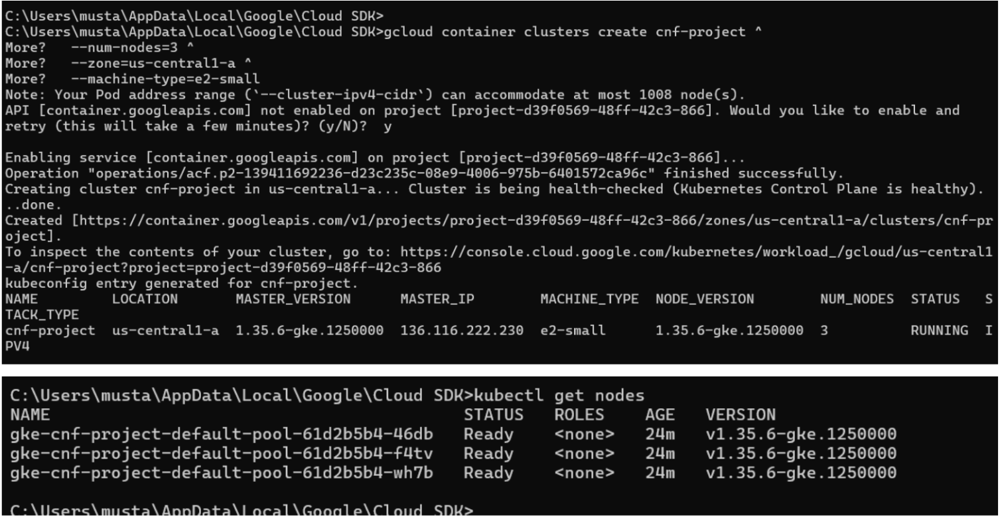
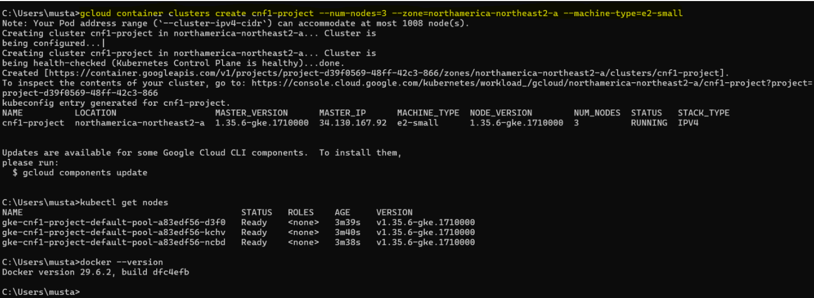
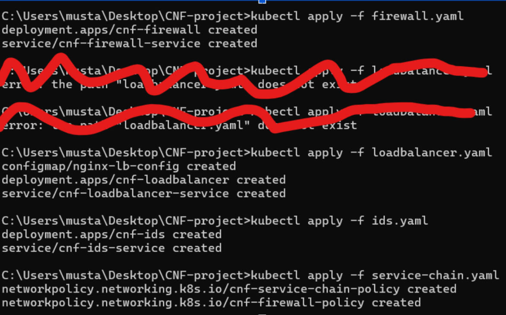
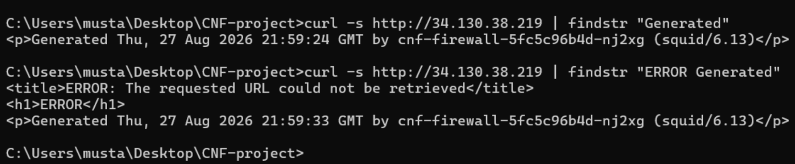
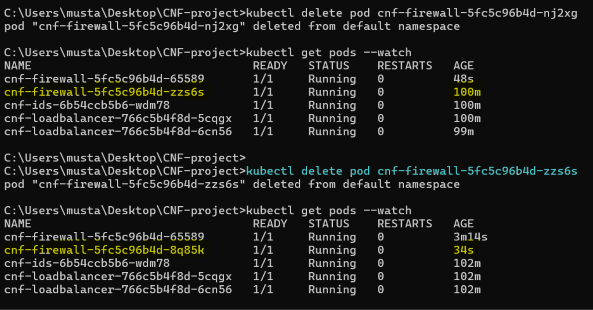
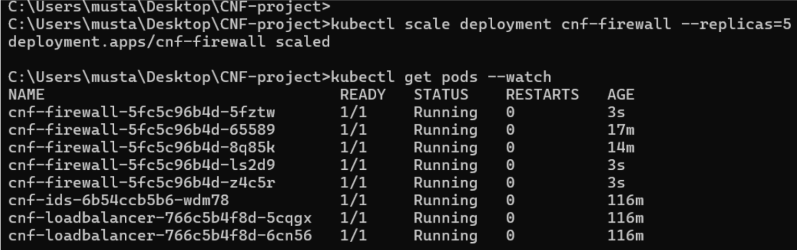
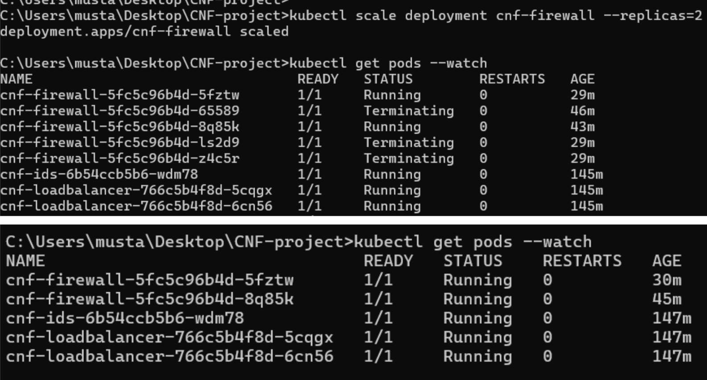
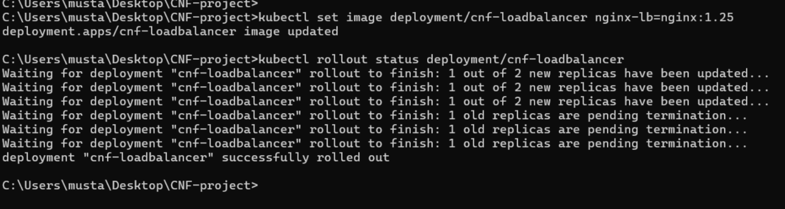
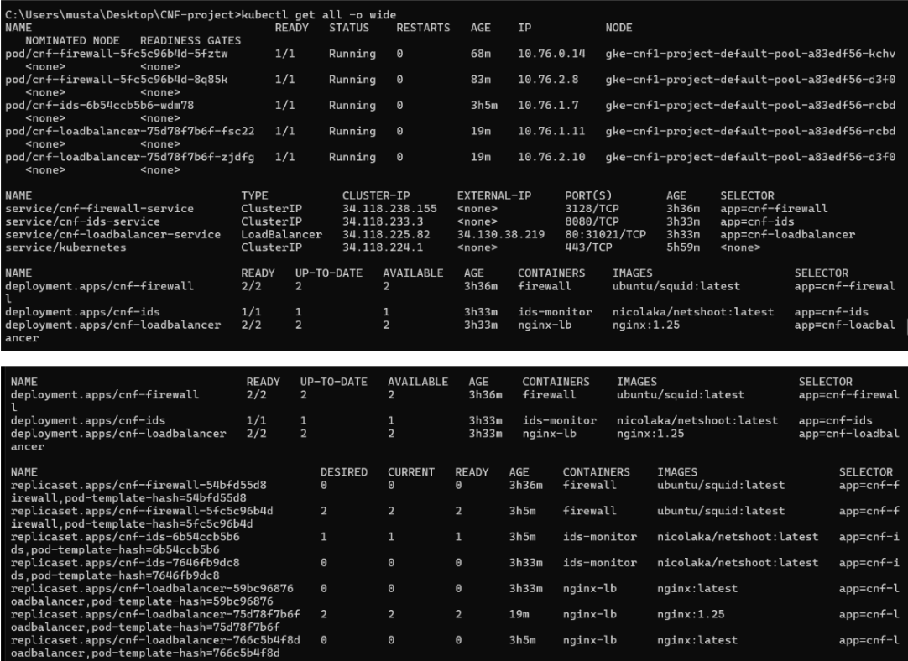

# CNF-kubernetes-project
Cloud-native network functions deployed on Kubernetes, including firewall, IDS, load balancing, scaling, and rolling updates.

# Containerized Network Functions (CNF) on Kubernetes

## Project Overview
Deployed a production-grade service chain of containerized network 
functions on Google Kubernetes Engine (GKE) demonstrating how CNFs 
outperform traditional VM-based network appliances in agility, 
scalability, and resilience.

## Architecture
Traffic Flow:
Internet → Load Balancer (NGINX) → Firewall (Squid) → IDS (Netshoot)

## CNFs Deployed
- **Firewall** (Squid) — 2 replicas for high availability
- **Load Balancer** (NGINX) — 2 replicas, public-facing
- **IDS Monitor** (Netshoot) — Network traffic inspection

How the test proved it: We sent a request from our computer to the project's public IP address, and the response came back saying it was generated by our Squid firewall. That proves the request successfully travelled from our computer → Google Cloud → load balancer → firewall.  

Why this is important: It proves the project isn't just configuration files sitting on a computer — the components were actually deployed in the cloud and can receive real network traffic from the internet. 

## Setting It Up

## Creating The Kubernetes Cluster 
Command: gcloud container clusters create cnf-project --num-nodes=3 --zone=northamerica-northeast2-a --machine-type=e2-small 

## Then Applying the YAML Files

## Testing Our Live Service Chain

## What This Demonstrates

### Resilience
- Pod auto-recovery in under 30 seconds vs minutes for VM recovery
- Kubernetes automatically replaces failed containers

Resilience / Self-Healing Test: We first confirmed that two firewall pods were running. We then manually deleted one firewall pod using kubectl delete pod. Because the deployment was configured to always maintain two firewall replicas, Kubernetes detected that one was missing and automatically created a new replacement pod with a new name. Within seconds, the replacement pod was running and the firewall deployment was back to two healthy pods without us manually recreating anything. 

### Scalability  
- Scaled firewall from 2 to 5 replicas in under 10 seconds
- Zero manual intervention required

Scalability Test: The firewall deployment was scaled from 5 running pods back down to 2. Kubernetes automatically terminated the extra firewall instances and kept the requested two healthy replicas running. This demonstrates how a cloud-native security service can quickly adjust capacity as network demand changes while maintaining availability.  
Now imagine a huge increase in traffic whether that's legitimate traffic or potentially something like a DDoS-style traffic flood. Two firewall instances could become overloaded. If the firewall can't inspect/process packets quickly enough, your security layer becomes a bottleneck.

Scaling Up

Scaling Back Down
 

### Agility
- Rolling updates with zero downtime
- Single command deployment vs hours of VM provisioning

The cybersecurity relevance is safe patching and maintenance: security/network services often need updates for bug fixes or vulnerabilities, and Kubernetes can replace instances gradually instead of taking the whole service offline at once. 
 

### Presenting Final Evidence

## Tech Stack
- Google Kubernetes Engine (GKE)
- Docker
- kubectl
- NGINX, Squid, Netshoot

## Commands Used
kubectl apply -f firewall.yaml
kubectl apply -f loadbalancer.yaml
kubectl apply -f ids.yaml
kubectl apply -f service-chain.yaml
